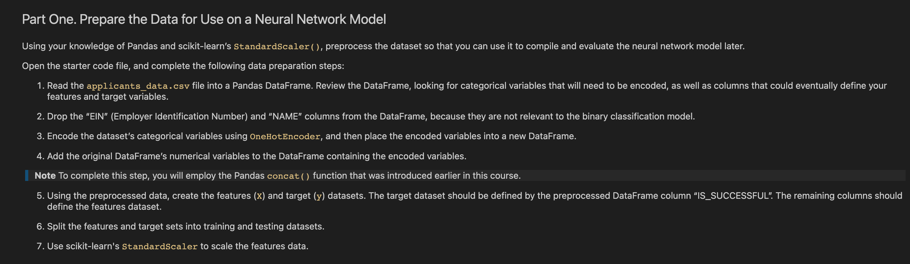
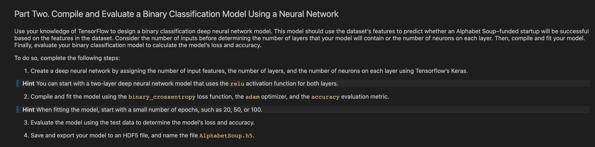
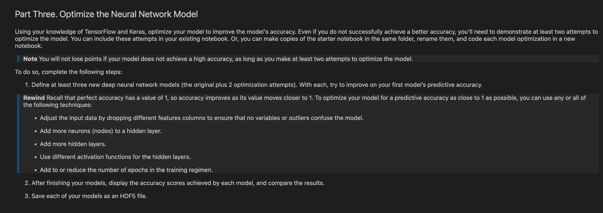

# venture_funding_with_deep_learning
Module 13

**The application is published [here](https://github.com/avangelinac/venture_funding_with_deep_learning) as a github project page.**

---
## Installation 
<!-- This is an example of how to list things you need to use the software and how to install them. -->
A text editor such as [VS Code](https://code.visualstudio.com/) or [Sublime Text](https://www.sublimetext.com/)

## Install

1. Clone the repo
   ```sh
   git clone https://github.com/avangelinac/venture_funding_with_deep_learning.git
   ```

2. You don't need to install pip - Conda comes with pip and you can also use the command
    conda install 'package name'
   
3. Install Conda according to the instructions based on your operating system.
    For windows users you MUST use the Administrator PowerShell. Users with AMD Processors MUST use the Administrator PowerShell 7 (X64) version
  
    Once installed Conda has an Admin PowerShell version shortcut - look on your Start menu for it.
    This shortcut will prove very useful at times when you need to install other apps or make adjustments to your installation

    Once installed you will see (base) on your terminal
   
4. Activate Conda Dev environment
   ```sh
   conda activate dev
   ```
   You should now see (dev) on your terminal

5. Install JupyterLabs
   ```sh
   pip install jupyterlab
   ```

6. Run JupyterLabs
   ```sh
   jupyter lab
   ```
   A browser window should open on localhost:8888/lab

## Usage

* [Python](https://www.python.org/)
* [Python conda](https://docs.conda.io/projects/conda/en/latest/user-guide/install/index.html)
* [Python JupyterLab](https://jupyter.org/)
* [Python pandas](https://pandas.pydata.org/)
* [Python tensorflow](https://www.tensorflow.org/install)
* [Python scikit-learn](https://scikit-learn.org/stable/)
* [Python hvplot.pandas](https://hvplot.holoviz.org/index.html)
---
## Instructions

The steps for this challenge are broken out into the following sections:

* Prepare the data for use on a neural network model.

* Compile and evaluate a binary classification model using a neural network.

* Optimize the neural network model.

- ### File Versions

There are two file versions GC_venture_funding_with deep_learning.ipynb AND venture_funding_with_deep_learning.ipynb

- ### Part 1

- ### Part 2

- ### Part 3



---
## Contributor Commits File Versions
Commits by Avangelina Cazares Parts 1-3

1. Fork the Project
2. Create your Feature Branch (`git checkout -b feature/AmazingFeature`)
3. Commit your Changes (`git commit -m 'Add some AmazingFeature'`)
4. Push to the Branch (`git push origin feature/AmazingFeature`)
5. Open a Pull Request

---
## Disclaimer
Not financial advice

---
## License
Maybe MIT & Open Source